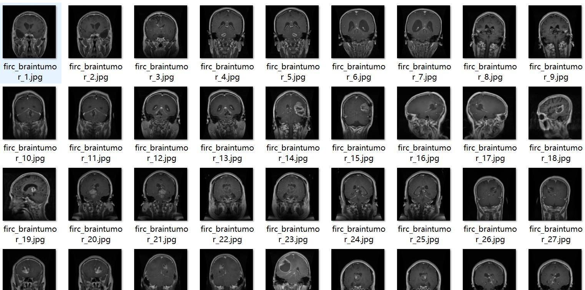
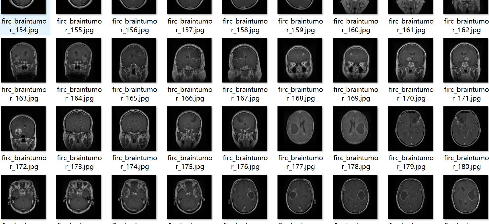
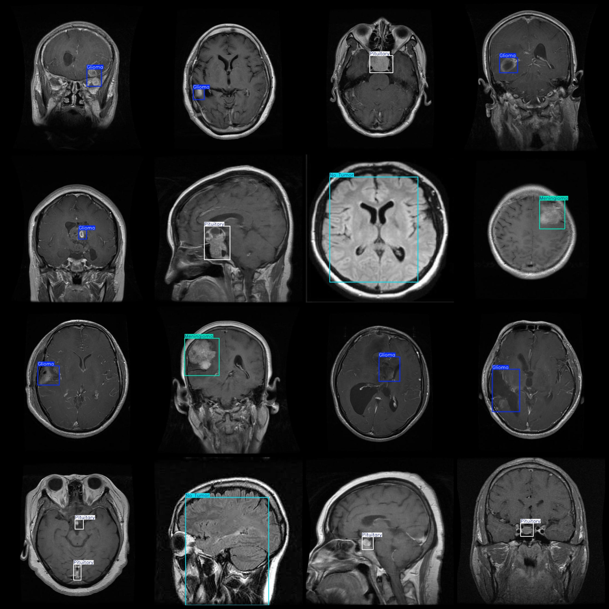

# Smart Medical Brain Tumor Detection Dataset VOC+YOLO Format, 2243 Images in 4 Categories

Note: Approximately half of the data is enhanced images, primarily inverted enhancements.
Dataset format: Pascal VOC format + YOLO format (txt file without split path, only containing jpg images and corresponding VOC XML files and YOLO txt files).
Number of images (jpg file count): 2443
Number of annotations (xml file count): 2443
Number of annotations (txt file count): 2443
Number of categories: 4
Annotation category names: ["Glioma", "Meningioma", "No Tumor", "Pituitary"] (please note that the order of categories in the YOLO format does not match this, but is based on the labels folder's 
classes.txt).
Number of boxes for each category:
- Glioma (Glioblastoma) = 830
- Meningioma (Cerebellar xanthoplasma) = 547
- No Tumor (No tumor) = 483
- Pituitary (Pituitary adenoma) = 612
Total number of boxes: 2472
Image resolution: 640x640
Annotation tool used: labelImg
Annotation rules: draw boxes around the categories
Important notes: None
Special declaration: This dataset does not guarantee the accuracy of trained models or weight files.
Image preview:

## Image

Here is a pay link on Stripe ( https://buy.stripe.com/3cs8yP7sY87d0vu9AB ). Please contact me lonlonago@foxmail.com after funding $89, and I will send you a complete data files , thank you!

